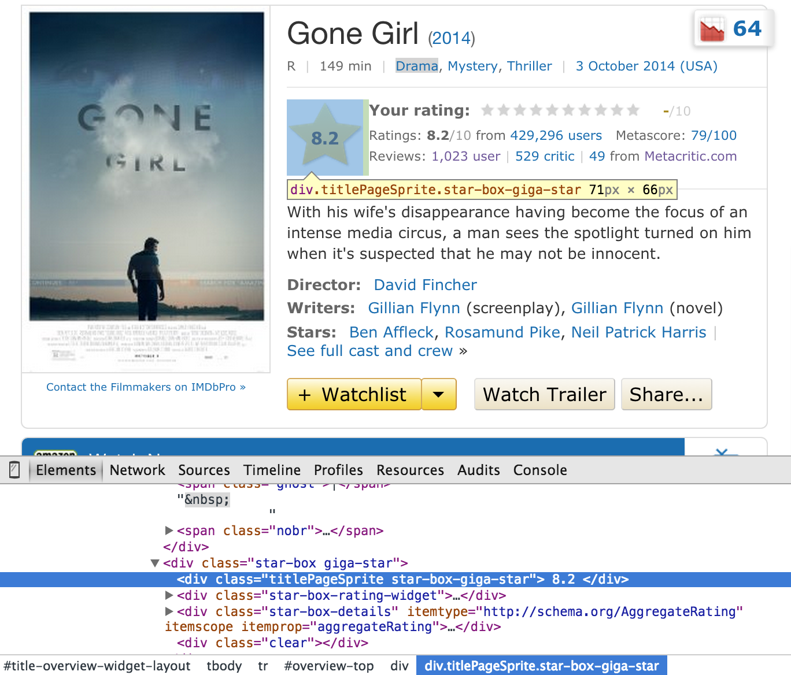
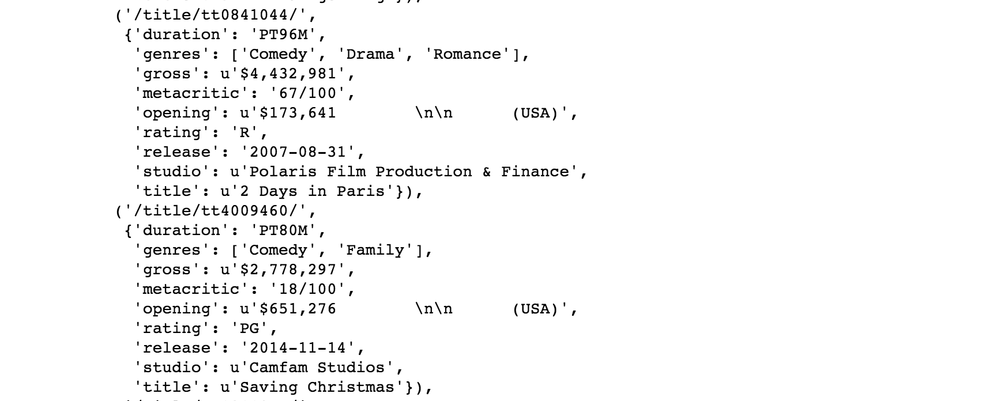

For my second data science project at Metis, I used web scraping to gather data on over 4000 films released in the past 15 years. BeautifulSoup is a great python package for web scraping which parses the html of a website and makes the elements on the page selectable so that they can be stored as data. A well designed website is generally easy to scrape because it includes many classes, ids and metadata in its html which can be used as selectors. I scraped my data from The Internet Movie Database, aka IMDB.

Figuring out how to get the information I wanted from each film's webpage took a bit of trial and error with BeautifulSoup. Once I had scraped 50 movies sucessfully, I tried scraping 300, and then ran my script for the entire dataset.

An important lesson I learned was to check my scraped data regularly. While the first 50 films were formatted exactly as I wanted, when I dove into more of my data I uncovered various problems. Not all film webpages were formatted exactly the same and some had missing information or were pulling the right information into the wrong place. With BeautifulSoup, it's best to be as specific as possible, to grab information based on html tags and attributes, rather than on which position you expect a piece of information to be located on the page. With a few adjustments, I fixed the problems in my script and scraped again.

Ah, yes... still in need of cleaning and formatting, but this looks like some minty fresh data I can work with!
