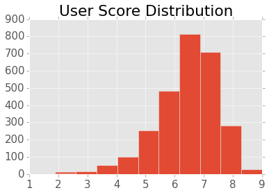
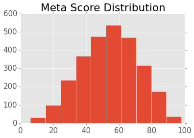

After scraping data on over 4000 films from IMDB, it was time to start making predictions. I set out to predict the quality of films. I was curious as to what attributes of a film could predict movie quality. Are some film studios better than others? Do studios release their best films during certain times during the year?

But first, how to measure quality? The two measures available on IMDB were the Metacritic score and IMDB user rating. The Metacritic score is an aggregate review score from various publications. Reviews from publications are weighted depending on the stature of the reviewer and the publication and then averaged to a Meta scrore between zero and 100. IMDB user ratings are simply an average of ratings submitted by IMDB users between 0 and 10. I decided to explore predicting both of these scores by building different linear regression models. 

The other film information I scraped from IMDB included the release date, duration of the film, genres, MPAA rating, production studio, opening weekend box office, US gross box office, the number of IMDB users who rated the film, and the number of users who reviewed the film.

My dataset included over 1000 different film studios. I needed a way to narrow them down to the most important studios so that I wouldn't over-complicate my model. I used the 20 most common studios in the dataset, but also looked at the studios with the highest average quality measures (user score or meta score). When I used studios with at least 10 films in my dataset, those with the highest average quality scores were significant in my model.

IMDB users seem to like nearly everything they rate, with an average user rating around 6.5 and very little variation. The only movie users really didn't like was Kirk Cameron's 'Saving Christmas', which rated 1.6.

Predicting Metacritic scores was another story. My model didn't perform very well, overrating low quality films and underrating high quality films.

 

It turns out that IMDB user ratings were easier to predict than Metacritic scores, but it seems that variation, or lack thereof, in quality measures has a lot to do with this.

This lead me to question, are user ratings biased? It's possible that people are more likely to rate films they like than those they don't like. Metacritic scores are also an aggregate of critics, not the average movie consumer whose tastes can vary quite widely. As Sly Stone might say, "Different strokes, for different folks, and so on and so on and scooby-dooby-dooby."
