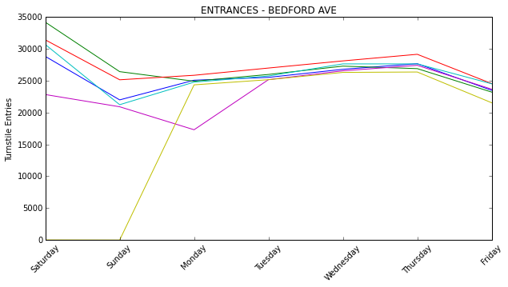

Working with data can be messy. Very messy. This week at Metis we worked on a project using MTA turnstile data. The bulk of my time was spent processing, cleaning, and reshaping the data to see what sorts of stories it could tell.

I accumulated all subway entries for all stations during the most recent six weeks, from May 16 to June 27. Each week of data starts at midnight on Saturday. Looking at a week of entries for 100 stations, ridership follows a similar pattern for most stations – fewer subway riders on the weekends and more traffic on weekdays – with most stations seeing lower volume. There are 468 subway stations overall.

I also looked at multiple weeks for a single station. For Union Square, the magenta line clearly stands out from the pattern – this week includes Memorial Day.

Bedford Avenue in Brooklyn looks quite different. The weekend traffic is higher than weekday traffic, except for one weekend in which there is none at all. Construction on the L train, again?!

I was curious about where people were going during the off-peak hours, so I did some additional digging. I expanded my dataset to thirteen weeks and looked at subway exits for late night hours, 8pm to 4am, and made some comparisons between weeknight and weekend. For weeknight I used the average of Monday through Wednesday ridership and for weekend the average of Friday and Saturday.

The exits during latenight hours look fairly similar for a station, regardless of whether it is a weekend or weeknight. The stations that saw the largest proportional increase on weekends were 51st street, which tripled from about 1350 exits on weeknights to 4190 on weekends, and East Broadway which more than doubled from 1270 on weeknights to 2900 on weekends. By volume these numbers are much lower than the 30,000 exits at Union Square on weekends, but I had no idea that 51st Street was such a latenight destination.

