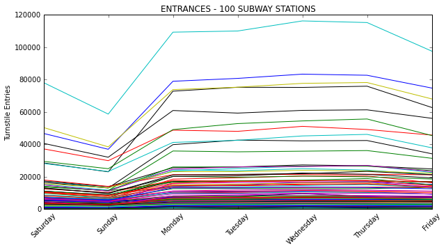

Working with data can be messy. Very messy.

This week at Metis we worked on a project using MTA turnstile data. The bulk of my time was spent processing, cleaning, and reshaping the data to see what sort of stories it might tell.

I accumulated all subway entries for all stations during the most recent six weeks. Ridership over a single week looks similar for most stations, with fewer subway riders on the weekends and a lot of traffic on weekdays. Here are just 100 stations (there are 468 subway stations overall).

I also looked at multiple weeks for a single station. The graph below is for 14th Street - Union Square. The magenta line represents the week including Memorial Day.

Bedford Ave in Brooklyn looks quite different. The weekend traffic is higher than weekday traffic, except for one weekend when there is none at all. Construction on the L train again, I presume.

I was really curious about the off-peak hours, so I did some additional digging. I filtered out subway exits for late night hours, 8pm to 4am, to find out where people are going and made some comparisons for weeknight as opposed to weekend. For weeknight I used the average of Monday through Wednesday ridership and for weekend the average of Friday and Saturday.

Overall the exits during latenight hours look fairly similar for a station, regardless of whether it is a weekend or weeknight. The stations that saw the largest proportional increase on weekends were 51st street, from about 1350 exits on weeknights to 4190 on weekends, and East Broadway which went from 1270 on weeknights to 2900 on weekends. By volume these numbers are quite low, much lower than the 30,000 exits at Union Square on weekends, but I had no idea that 51st Street was such a latenight destination.

