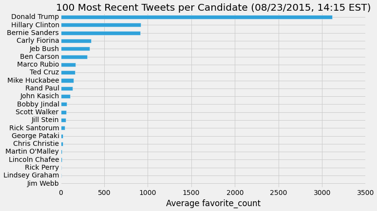
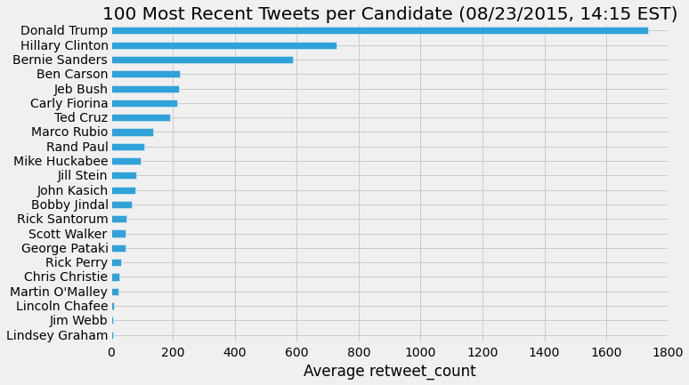
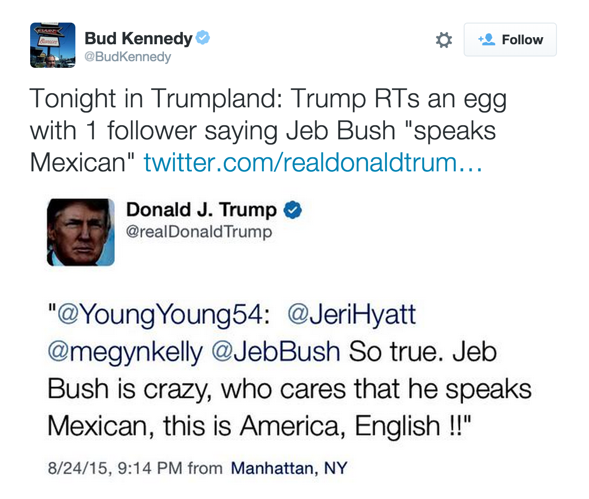
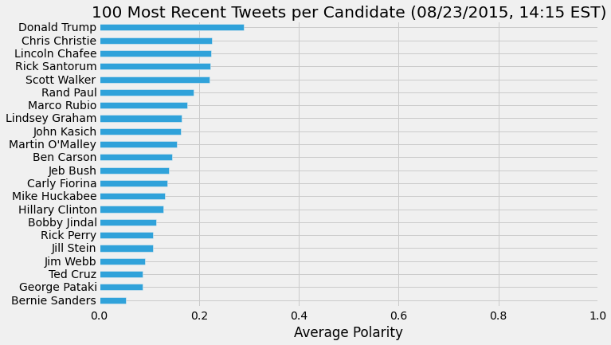
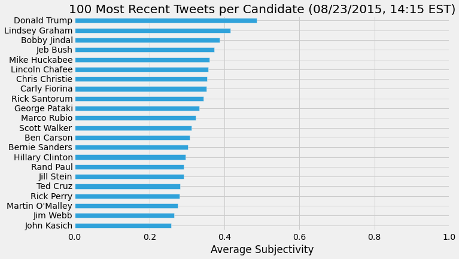
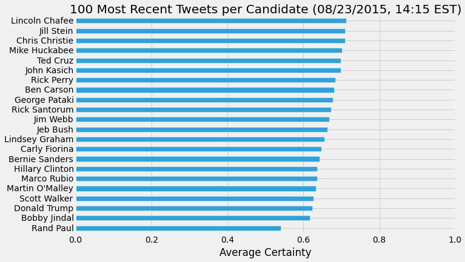

This week I used some natural language processing techniques and built a web app for exploring the tweets of the U.S. presidential candidates, or, as I call them, candidential tweets.

There are currently over 700 people who have [officially filed with the FEC](http://www.fec.gov/press/resources/2016presidential_form2dt.shtml) to run for president of the United States. I focused on 22 candidates -- 17 Republicans, 4 Democrats, and 1 from the Green Party -- and pulled their most recent tweets into Python using the twitter API and the Tweepy Python package. I first looked at some basic statistics; who has the most retweets? Who has the most favorites? 

I should mention here that basing predictions of who will get their party nomination on Twitter favorites or retweets is quite dubious. It's one thing to click a 'like' or 'share' button on a social media site, but quite another to actually get your butt down to the polling station on election day. Also, some twitter users may retweet a candidate, not as an endorsement or show of support, but to ridicule them.

It's also still early in the nomination process, and a lot could change in the next year. What these numbers can show is simply the level of social media engagement each candidate achieves.

Next I used a Python package for text analysis, [pattern.en](http://www.clips.ua.ac.be/pages/pattern-en). This package contains functions for extracting sentiment and mood from text. From the pattern.en documentation:

> Written text can be broadly categorized into two types: facts and opinions. Opinions carry people's sentiments, appraisals and feelings toward the world. The pattern.en module bundles a lexicon of adjectives (e.g., *good*, *bad*, *amazing*, *irritating*, ...) that occur frequently in product reviews, annotated with scores for sentiment polarity (positive ↔ negative) and subjectivity (objective ↔ subjective).

> The `sentiment()` function returns a `(polarity, subjectivity)`-tuple for the given sentence, based on the adjectives it contains, where polarity is a value between -1.0 and +1.0 and subjectivity between 0.0 and 1.0. ... Accuracy is about 75% for movie reviews.

I extracted the polarity and subjectivity for each tweet using the sentiment function and then found the average polarity and subjectivity for each candidate's tweets.

To calculate the level of certainty for each candidate, I used the pattern.en modality funtion.

> The `modality()` function returns the degree of certainty as a value between -1.0 and +1.0, where values > +0.5 represent facts. For example, "I wish it would stop raining" scores -0.35, whereas "It will stop raining" scores +0.75. Accuracy is about 68% for Wikipedia texts.

The documentation uses the term *facts* here to describe text with high modality, but I would argue that this does not indicate a level of truth, only the level of confidence or certainty expressed by the writer. I have seen many writers express absolute falsehoods with a high level of certainty.

With the modality function, I gave each tweet a certainty score and, again, found the average for each candidate's tweets. Unsurprisingly, presidential candidates express themselves with a high degree of certainty.

Finally, I packaged all of this into a script and created a simple web application using [Spyre](https://github.com/adamhajari/spyre). You can see the app in action [on my website](http://www.emilyschuch.com/works/candidential-tweets/) or take a look at the code [on GitHub](https://github.com/emschuch/NLP_presidential_candidate_tweets).

While my original analysis was conducted on the 100 most recent tweets, I restricted the number of tweets to 20 for the web app. First, I felt this would give users more up to date information (most candidates tweet 20 times in just a few days). Second, it protects the web app from go down due to exceding the rate limit of the Twitter API (which occured a few times during testing).

Personally, I'm quite curious to see how these numbers will change as election season continues.
