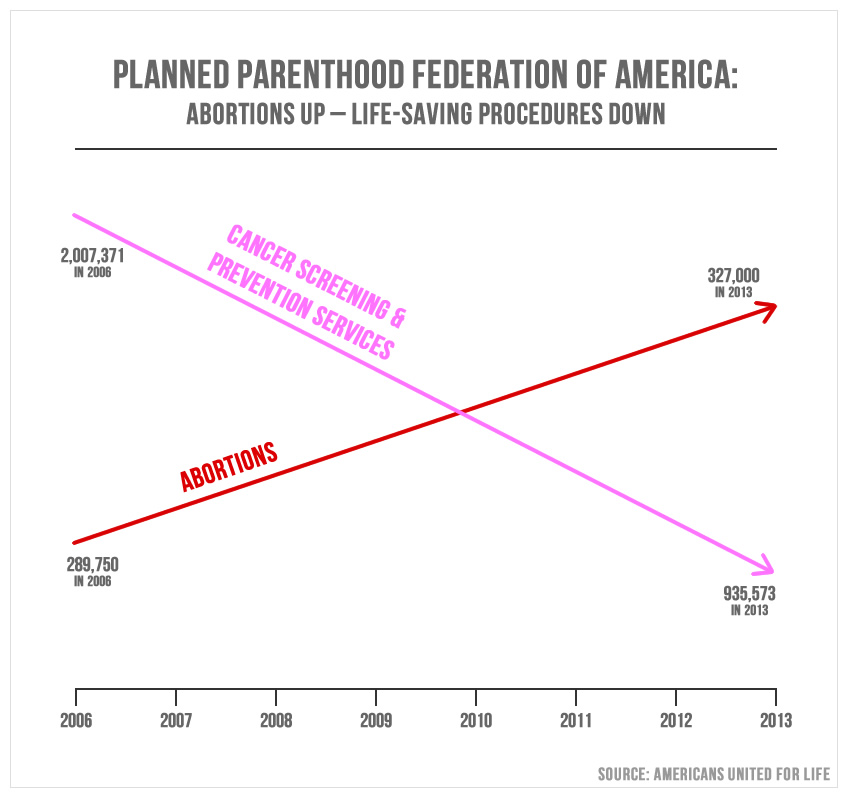

Rule 1: Include a properly scaled y-axis.

This seems like it should be easy, a no-brainer, yet the people at Americans United for Life (AUL) did not follow this simple rule when creating the chart below. This chart was shown briefly during a House government oversight committee on September 29th in which Cecile Richards, president of Planned Parenthood, was questioned by House Republicans.



AUL defended their chart in a barely readable [blog post](http://www.aul.org/2015/09/aul-debunks-abortion-industry-falsehoods-about-a-simple-fact-planned-parenthood-doing-more-abortions-and-fewer-health-screenings/).

> “...activist media sites exploded in a furry [sic] of smoke and mirrors, trying to critique the visual rather than discuss the mathematical reality behind it.”

Let’s be clear, there is NO mathematical reality in AUL’s chart. The chart is a lie.

I was able to track down the annual reports published by Planned Parenthood for all years from 2006 to 2013 except for 2008. While the annotated numbers AUL uses are true, the two lines are false, they should not cross one another. The number of abortions performed by Planned Parenthood is less than the number of cancer screenings, and has been for the entire time period from 2006 to 2013. In mathematical reality, 327,000 is less than 935,573. 

In case my math skills were really rusty, I could even check that in my computer terminal. On a Mac, you can open a new terminal window and type the following.

```
python

327000 < 935573

327000 > 935573
```

The output should look something like this:


Planned Parenthood’s annual reports also contain figures on other services they provide, such as STI / STD screenings & treatment, contraceptive services, and pregnancy & prenatal services. I made a new chart from this data and included all of the different types of services performed by Planned Parenthood.


When these numbers are plotted with an honest-to-goodness common y-scale, the number of abortions appears nearly flat. There is, however, a decline in cancer screenings starting in 2009. At first I wondered if this might be due to the Affordable Care Act. Are people visiting PP less often for this service because more have health insurance and can see their private doctor? But this didn’t make much sense, since the ACA only took effect in 2013. Why did cancer screenings start declining in 2009? 

I posted a version of this chart on twitter and someone posited a plausible answer.

<blockquote class="twitter-tweet" data-conversation="none" lang="en"><p lang="en" dir="ltr"><a href="https://twitter.com/emschuch">@emschuch</a> <a href="https://twitter.com/PPFA">@PPFA</a> <a href="https://twitter.com/albertocairo">@albertocairo</a> cervical cancer screening guidelines started changing 2009. Maybe related to decrease? <a href="https://t.co/rBDWbMnNlr">https://t.co/rBDWbMnNlr</a></p>&mdash; kimu (@kimu) <a href="https://twitter.com/kimu/status/649697099219529728">October 1, 2015</a></blockquote>
<script async src="//platform.twitter.com/widgets.js" charset="utf-8"></script>

National guidelines for the frequency of cervical cancer screenings were officially changed in 2012, but [the American College of Obstetricians and Gynecologists started advising a reduction of frequency in  2009](http://well.blogs.nytimes.com/2012/03/14/new-guidelines-advise-less-frequent-pap-smears/?_r=0). Previously, women received a pap smear to screen for cervical cancer once a year, but it is now recommended that pap smears should be performed every three years. In addition, [changes in recommendations](http://www.nytimes.com/2009/11/17/health/17cancer.html) were made in 2009 regarding how early and often women should begin receiving regular mammograms. The recommended age to start breast cancer screenings went from 40 to 50 years of age for healthy women, and should occur less frequently, once every two years rather than every year, according to these guidelines.

It turns out that properly plotting your data is a great way to find out what’s really going on.

It’s also worth mentioning, and possibly worth shouting, that THE VAST MAJORITY OF PLANNED PARENTHOOD SERVICES ARE NOT RELATED TO ABORTION! The most common services provided by Planned Parenthood overall were STI / STD testing & treatment, and contraception services. In 2013, Planned Parenthood provided nearly 4.5 million services related to STI / STD testing & treatment, and over 3.5 million contraception services. Providing people with affordable access to contraception seems like a great way to prevent unwanted pregnancies and possibly prevent someone from seeking an abortion in the first place.

####Full Disclosure:

The chart shown here is an update from one I originally posted on twitter. I made the following changes from the original:

* I deleted the subtitle, “People served from 2006 to 2013”. This chart is not showing number of people, but the number of times a service was provided.
* I added dots to the data points. I was unable to find the 2008 Planned Parenthood annual report and do not want to imply that 2008 data is included.

It was also suggested that the data should be normalized for population. I did this, finding the number of times a service was performed per 10,000 people in the population, and the chart is nearly identical, though the numbers change on the y-axis.


The data used and links to original sources are available [here](https://docs.google.com/spreadsheets/d/1vzkuzSi2S-JO0m0VolflzxaMN9wUfjw6Slek97_6L4s/edit?usp=sharing).
